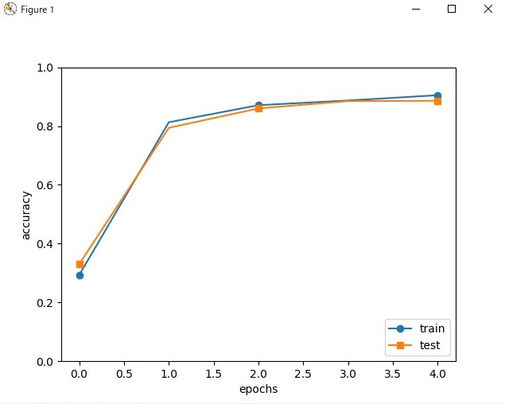

###実行結果

###cnnの実行

    train loss:2.3000286547991533
    ===poch:1,     train acc:0.293, test acc:0.33 ===
    train loss:2.2978611632578034
    train loss:2.2936545325222153
    train loss:2.2861122509624807
    train loss:2.2797780488139816
    train loss:2.2655374583355767
    train loss:2.2565653569092126
    train loss:2.2352318693849584
    train loss:2.1998858153843575
    train loss:2.2028808411326146
    train loss:2.1252787126743042
    train loss:2.184904004427109
    train loss:2.078588097849766
    train loss:2.047841248919827
    train loss:1.9713672502984807
    train loss:1.9371574505475735
    train loss:1.879205919125194
    train loss:1.8458483593834805
    train loss:1.7630866628296156
    train loss:1.6907841690933083
    train loss:1.628472533510587
    train loss:1.5129197112546187
    train loss:1.4565379445264721
    train loss:1.4147582583305047
    train loss:1.3192687984063929
    train loss:1.1406064767593131
    train loss:1.092671166908607
    train loss:1.0212182429279384
    train loss:0.9606985543695334
    train loss:1.0259642142192733
    train loss:0.8946030495693487
    train loss:0.6540991541277138
    train loss:0.7525616813928901
    train loss:0.6985726075064675
    train loss:0.8821851895628883
    train loss:0.5894486653852118
    train loss:0.798693538530034
    train loss:0.5778381660855858
    train loss:0.4532496540017791
    train loss:0.5893541397974951
    train loss:0.5894980830842355
    train loss:0.5274197788661767
    train loss:0.534794208134568
    train loss:0.5599063132073709
    train loss:0.5253126186151905
    train loss:0.6850144452566629
    train loss:0.3852069626298518
    train loss:0.6141147949040645
    train loss:0.6136456556744343
    train loss:0.38959405910638717
    train loss:0.48202179126120326
    ===poch:2,     train acc:0.813, test acc:0.794 ===
    train loss:0.5088451454651856
    train loss:0.5247900747628068
    train loss:0.46478105830054134
    train loss:0.6037499690751056
    train loss:0.43474562307158165
    train loss:0.42715868189535555
    train loss:0.5351204120923083
    train loss:0.5045901777317533
    train loss:0.4248464707506318
    train loss:0.4888916573472742
    train loss:0.334827932822349
    train loss:0.47265605291395457
    train loss:0.5210269745018471
    train loss:0.510251342150625
    train loss:0.35231448793816006
    train loss:0.31235032435504745
    train loss:0.6295002890991358
    train loss:0.45222131794312
    train loss:0.3798178391707684
    train loss:0.45186574417905767
    train loss:0.47643234370200593
    train loss:0.30794982092194295
    train loss:0.3565055561710126
    train loss:0.4593678639885566
    train loss:0.5166981706159431
    train loss:0.3943446059849145
    train loss:0.44667818386473385
    train loss:0.26219198757632883
    train loss:0.3723346786033413
    train loss:0.3585301258503433
    train loss:0.4458793407074104
    train loss:0.3927999082108952
    train loss:0.24189787386451386
    train loss:0.32120010705656227
    train loss:0.3637964768490339
    train loss:0.5073949924699308
    train loss:0.3082189541548209
    train loss:0.3028057130590443
    train loss:0.2297126618052327
    train loss:0.2704399843531067
    train loss:0.3147032205297893
    train loss:0.4857909668939941
    train loss:0.37690674568677607
    train loss:0.29512649774216565
    train loss:0.2024690181564507
    train loss:0.3627394690438225
    train loss:0.3341630529365737
    train loss:0.43504754908464244
    train loss:0.3515452940582464
    train loss:0.366500170882679
    ===poch:3,     train acc:0.871, test acc:0.86 ===
    train loss:0.3817963275716383
    train loss:0.4124803012401078
    train loss:0.4372131135705203
    train loss:0.3547488666345329
    train loss:0.3731740732861323
    train loss:0.4794704694066324
    train loss:0.35344358830057365
    train loss:0.39114582476840054
    train loss:0.3943842663870077
    train loss:0.29571635215607234
    train loss:0.28650488552420106
    train loss:0.2039386176747233
    train loss:0.2868563768722445
    train loss:0.34582094493854953
    train loss:0.35121913826409307
    train loss:0.2363800147829799
    train loss:0.19680863257921546
    train loss:0.23869164139482077
    train loss:0.24514335519537508
    train loss:0.37227554362558196
    train loss:0.2664354080635302
    train loss:0.41308430073921676
    train loss:0.2281363853515769
    train loss:0.3199513365313383
    train loss:0.23249206681340184
    train loss:0.4408666209812037
    train loss:0.4780283233435563
    train loss:0.37811624779891845
    train loss:0.3740140451824889
    train loss:0.489763536141182
    train loss:0.447396864399335
    train loss:0.39054195114112233
    train loss:0.36499595930972506
    train loss:0.23809128416250544
    train loss:0.3054754394177847
    train loss:0.31525617304055886
    train loss:0.23121782395158053
    train loss:0.19211414997204992
    train loss:0.2805287744369725
    train loss:0.3002952173923814
    train loss:0.24102612585495542
    train loss:0.28129950429547634
    train loss:0.2880812714452094
    train loss:0.1869668168021013
    train loss:0.23500281604880027
    train loss:0.341232384385201
    train loss:0.2808287862495844
    train loss:0.3856074111459108
    train loss:0.28106486103732214
    train loss:0.26395259993181436
    ===poch:4,     train acc:0.887, test acc:0.885 ===
    train loss:0.2759311291882584
    train loss:0.17047713206531084
    train loss:0.23717947032094672
    train loss:0.14456500281351617
    train loss:0.29042575537120724
    train loss:0.26371784574912416
    train loss:0.2697928600276526
    train loss:0.2914945004995337
    train loss:0.36532393039459365
    train loss:0.26413674669685294
    train loss:0.2942040125384206
    train loss:0.21903217810563474
    train loss:0.3223571074443823
    train loss:0.2199852055430044
    train loss:0.2455460601119737
    train loss:0.4432703387869342
    train loss:0.2821270547043555
    train loss:0.24348855377599093
    train loss:0.2448537640427787
    train loss:0.19179718759961056
    train loss:0.3922206253853211
    train loss:0.13038793471939056
    train loss:0.2675542769896164
    train loss:0.11289448637252039
    train loss:0.3053481630822535
    train loss:0.26794220768583044
    train loss:0.374082255427536
    train loss:0.2256850673705872
    train loss:0.3386451707476045
    train loss:0.2868125572092208
    train loss:0.2638497607656752
    train loss:0.3754220278382639
    train loss:0.24933314144388644
    train loss:0.2696451859579945
    train loss:0.23330369331831785
    train loss:0.10292825373352153
    train loss:0.23720609071826737
    train loss:0.3560012107427069
    train loss:0.3347734650499813
    train loss:0.1744532910051574
    train loss:0.17263451727980098
    train loss:0.17343075235235705
    train loss:0.14980794125945004
    train loss:0.26318050970080104
    train loss:0.2576106940500909
    train loss:0.1907958600844929
    train loss:0.23292606917207376
    train loss:0.26856383940583445
    train loss:0.25138697605060917
    train loss:0.31425024858008915
    ===poch:5,     train acc:0.905, test acc:0.886 ===
    train loss:0.22030917876880174
    train loss:0.2866293830896205
    train loss:0.24940698600438804
    train loss:0.21372685415778692
    train loss:0.3688101810268756
    train loss:0.1919805269321579
    train loss:0.3245768737682698
    train loss:0.2987022963452608
    train loss:0.20361526090994098
    train loss:0.3441088043335057
    train loss:0.13927836029141175
    train loss:0.1643047585088383
    train loss:0.22008989374930343
    train loss:0.24864607992214105
    train loss:0.3089515867418141
    train loss:0.20232976173991607
    train loss:0.2129003112163144
    train loss:0.20122860066289125
    train loss:0.12733457610427504
    train loss:0.15146941118308374
    train loss:0.18368371289617752
    train loss:0.15076860591806984
    train loss:0.29296137001076084
    train loss:0.117192935093763
    train loss:0.2026560799943222
    train loss:0.234440204695983
    train loss:0.23013405120360417
    train loss:0.3330131776255272
    train loss:0.42800366776441506
    train loss:0.3879683232077722
    train loss:0.31002724820131405
    train loss:0.29970676602261065
    train loss:0.30861518607966654
    train loss:0.14119312307403928
    train loss:0.2736598111405412
    train loss:0.1354405282641615
    train loss:0.24919582077720384
    train loss:0.25826761665871734
    train loss:0.3232242150063977
    train loss:0.29794033561233807
    train loss:0.18242042787633106
    train loss:0.3215349043081623
    train loss:0.1627047092184754
    train loss:0.1663801173642914
    train loss:0.24254763410679367
    train loss:0.12380326147828774
    train loss:0.23923837743290682
    train loss:0.12314924726745506
    train loss:0.20830962678142387
    =============== Final Test Accuracy ===============
    test acc:0.899
    Saved Network Parameters!

##<感想>
今回の講義では、CNNについて学習した。
ゆくゆくは画像処理を行ってみたいと考えているため、
しっかりと復習して行っていきたい。

##<参考文献>
教材: 第五回 情報学工房  
　　: ゼロから作るDeep Learning